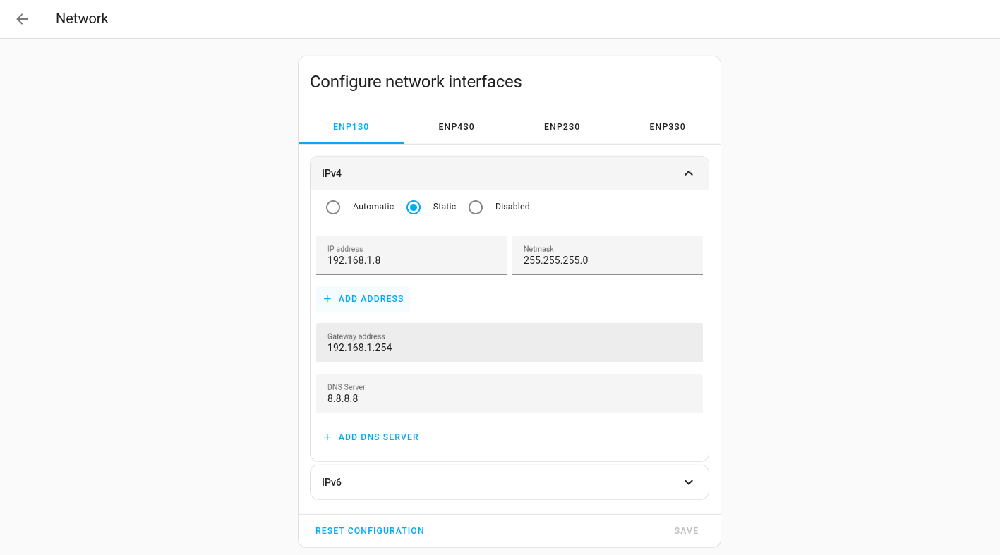

# Home Assistant App: Dnsmasq-DHCP

## Table of Contents

- [Installation](#installation)
- [Requirements](#requirements)
- [Concepts](#concepts)
- [App Configuration](#app-configuration)
- [HomeAssistant Configurations](#homeassistant-configurations)
- [Using the App Beta version](#using-the-app-beta-version)
- [Development](#development)
- [Links](#links)

## Installation

Follow these steps to get the `Dnsmasq-DHCP` App installed on your system:

1. Add the HomeAssistant app store for this app by clicking here: [](https://my.home-assistant.io/redirect/supervisor_add_addon_repository/?repository_url=https%3A%2F%2Fgithub.com%2Ff18m%2Fha-addons-repo)

By doing so you should get to your HomeAssistant "Manage app repositories" dialog window and you should be asked to add `https://github.com/f18m/ha-addons-repo` to the list. Click "Add".

2. In the list of Apps, search for "Francesco Montorsi addons" and then the `Dnsmasq-DHCP` App and click on that. There is also a "BETA" version available, skip it unless you want to try the latest bugfixes and developments.

3. Click on the "INSTALL" button.


## Requirements

You need to make sure you don't have other DHCP servers running already in your network.
You will also need all details about the network(s) where the DHCP server will be running (in other words,
the details of the networks attached to your HomeAssistant server):

* the network interface(s);
* the netmask;
* the gateway IP address (your Internet router typically; in most countries this is provided by the [ISP](https://it.wikipedia.org/wiki/Internet_service_provider));
* an IP address range free to be used to provision addresses to DHCP dynamic clients
* optionally: the upstream DNS server IP addresses (e.g. you may use Google DNS servers or Cloudflare quad9 servers), if you want to enable the DNS functionality;
* optionally: the upstream NTP servers;

An example for above elements could be:

* the network interface(s): `eth0`
* the netmask: `255.255.255.0`
* the gateway IP address: `192.168.1.1`
* an IP address range free to be used: `192.168.1.200` - `192.168.1.250`
* upstream DNS server IP addresses: `8.8.8.8`
* upstream NTP servers: `0.north-america.pool.ntp.org` or `0.europe.pool.ntp.org`

Another important requirement is that the server which is running HomeAssistant must
be configured to use a **STATIC IP address** in your network.
In other words, **you cannot use DHCP to configure the device where the DHCP server will be running !!**
See next sections for more details.

Once you have collected all elements above you can start editing the `Dnsmasq-DHCP` addon configuration. 
However, before getting there, the [Concepts section](#concepts) below provides the meaning for some terms that will appear in the [Configuration section](#configuration).
Take a few minutes to go over it.


## Concepts

### DHCP Pool

The DHCP server needs to be configured with a start and end IP address that define the 
pool of IP addresses automatically managed by the DHCP server and provided dynamically to the clients
that request them.
See also [Wikipedia DHCP page](https://en.wikipedia.org/wiki/Dynamic_Host_Configuration_Protocol)
for more information.
Please note that the configured network should use private IP addresses both for its start/end IPs.
A private IP is defined in RFC 1918 (IPv4 addresses) and RFC 4193 (IPv6 addresses).
Check [wikipedia page for private networks](https://en.wikipedia.org/wiki/Private_network) for more information.

### DHCP Static IP addresses

The DHCP server may be configured to provide a specific IP address
to a specific client (using its [MAC address](https://en.wikipedia.org/wiki/MAC_address) as identifier).
These are _IP address reservations_.
Note that static IP addresses do not need to be inside the DHCP range; indeed quite often the
static IP address reserved lies outside the DHCP range.

### DHCP Friendly Names

Sometimes the hostname provided by the DHCP client to the DHCP server is really awkward and
non-informative, so `Dnsmasq-DHCP` allow users to override that by specifying a human-friendly
name for a particular DHCP client (using its MAC address as identifier).

### DHCP MAC Address Blocklist

The DHCP server can be configured to ignore DHCP requests from specific MAC addresses.
Any MAC address added to the `dhcp_mac_address_blocklist` will be silently ignored by the DHCP server,
meaning those devices will not receive an IP address from this DHCP server.

### Upstream DNS servers

If the DNS server of `Dnsmasq-DHCP` is enabled (by setting `dns_server.enable` to `true`),
then `Dnsmasq-DHCP` maintains a local cache of DNS resolutions but needs to know which
external or _upstream_ DNS servers should be contacted when something in the LAN network 
is asking for a DNS resolution that is not cached.
The upstream servers typically used are:

* Google DNS servers: `8.8.8.8` and `8.8.4.4`
* Cloudflare DNS servers: `1.1.1.1`

but you can actually point `Dnsmasq-DHCP` DNS server to another locally-hosted DNS server
like e.g. the [AdGuard Home](https://github.com/hassio-addons/addon-adguard-home) DNS server
to block ADs in your LAN.

### HomeAssistant mDNS

HomeAssistant runs an [mDNS](https://en.wikipedia.org/wiki/Multicast_DNS) server on port 5353.
This is not impacted in any way by the DNS server functionality offered by this app.


## App Configuration

The following YAML file shows all possible `Dnsmasq-DHCP` app configurations and their default values.
All configuration settings mentioned in the [Requirements](#requirements) section should go into this YAML document:

```yaml
# The interfaces on which the DHCP/DNS server will listen
# DHCP requests are listened on port 67
# DNS requests are listened on port 53 (DNS port is configurable via dns_server.port key)
# Each value can be set to "auto" to automatically select the network interface that routes
# traffic to the internet (determined by the egress route to 1.1.1.1).
interfaces:
  - enp1s0

# DHCP server configs that apply to all networks later defined in "dhcp_pools"
dhcp_server:
  # Lease time for all DHCP clients except those having an IP address reservation.
  default_lease: 1h

  # Lease time for all DHCP clients having an IP address reservation.
  # The address reservation lease might also be 'infinite' but this is discouraged since
  # it means that the DHCP clients will never come back to this server to refresh their lease
  # and this makes the whole DHCP server less useful... it's better to force the clients
  # to some frequent check-in, since that becomes a basic heartbeat / client health check.
  address_reservation_lease: 1h

  # The app can detect whether the server which is running the app has just rebooted;
  # if that's the case and the following flag is set to "true", then the DHCP lease database
  # is reset before starting the DHCP server; this is useful in case a loss of power of the
  # HomeAssistant server means also a loss of power of several/all DHCP clients. In such a case
  # the old DHCP lease database is not useful and actually misleading.
  reset_dhcp_lease_database_on_reboot: false

  # The app keeps track of all "past DHCP clients", i.e. clients that connected in the past
  # but missed to renew their DHCP lease. These are shown in the "Past DHCP Clients" tab in the web UI.
  # This setting allows to cleanup that view after a certain amount of time. 
  # The default value of 30 days means that you will see DHCP clients that connected up to 30days back,
  # no more. If you set this option to ZERO, then the cleanup of old DHCP clients is disabled and the UI
  # will show any client that has ever connected to the server.
  forget_past_clients_after: 30d

  # Shall every DHCP request be logged?
  log_requests: true

  # DNS domain to advertise in DHCP answers
  dns_domain: lan

  # DNS servers to advertise in DHCP answers.
  # Note that even if online someone is naming these as "primary" and "secondary" DNS servers,
  # the DHCP clients are free to use them in any order they like, or even to use only one of them.
  # There is no "primary" or "secondary".
  # In particular if you use "dns_server.enable=true", then you want to provide in this list ONLY "0.0.0.0"
  # (special IP address which is translated to the IP of the machine running dnsmasq) as DNS server. 
  # If you use "dns_server.enable=false", you want to provide some public DNS server (and you can provide
  # more than one if you like), e.g. 8.8.8.8, 1.1.1.1, etc.
  dns_servers:
    - 0.0.0.0
  
  # NTP servers to provide in DHCP answers.
  # Note that not all clients will honor this setting; some devices will require you to manually configure/change
  # the NTP settings through their custom configuration pages.
  ntp_servers:
    # Where can you find reliable NTP servers? https://www.ntppool.org is your answer.
    # example1: online NTP servers: check https://www.ntppool.org/zone/@ for details about continental zones:
    - 0.europe.pool.ntp.org
    - 1.europe.pool.ntp.org
    - 2.europe.pool.ntp.org
    # example2: another way to go is to use Google NTP:
    #- time1.google.com
    #- time2.google.com
    #- time3.google.com
    # example3: the entry 0.0.0.0 means "the address of the machine running dnsmasq"
    #- 0.0.0.0

    dnsmasq_customizations:
      # See https://thekelleys.org.uk/dnsmasq/docs/dnsmasq-man.html as reference for this section.
      # This option allows you to add ANY custom dnsmasq option that you want.
      # With such power comes great responsibility, so please be careful, as you might generate
      # invalid dnsmasq configurations preventing the app from starting.
      # Remember that all dnsmasq options written here must _not_ start with the leading "--" dash:
      # e.g. the --dhcp-option mentioned in dnsmasq manpage needs to be written here as "dhcp-option".
      # In this section you typically want to provide a YAML multiline string so make sure you use
      # the pipe | character. See e.g.:
      #    dnsmasq_customizations: |
      #      dhcp-option=option:vendor-class-identifier,HomeAssistant
      #      dhcp-option=option:vendor-info,HomeAssistant
      #      dhcp-option=option:domain-search,lan
      # The content of this section will just end-up "as is" (without any validation check) in
      # the dnsmasq config file.
  
# dhcp_pools is the core config for the DHCP server.
# Each entry in the list represents a network segment. 
# You can have multiple entries for the same "interface" (with same "gateway" and "netmask") 
# to provide disjoint IP address ranges within the same network (e.g. if you want to provide .100-120 and .200-220
# IP addresses of the same network).
# You can provide IP ranges of different networks in case e.g. the DHCP server
# is attached to multiple network interfaces (i.e. attached to different networks).
#
# In any case remember that the "gateway" IP address must always be an IP address within the
# network specified by the "start", "end" and "netmask" properties.
dhcp_pools:

    # each DHCP pool starts with the "interface" on which a specific IP range / IP network will be served;
    # set to "auto" to automatically select the interface that routes traffic to the internet;
    # remember that all interfaces referenced by DHCP pools should also appear in the top-level "interfaces"
    # configuration key
  - interface: enp1s0
    # the "start" IP address is the first IP that is available to DHCP clients
    start: 192.168.1.50
    # the "end" IP address must always be numerically larger than the "start" IP
    end: 192.168.1.150
    # the "gateway" IP address is the gateway/router to advertise in DHCP answers, 
    # typically is the router that allows to reach out to the Internet
    gateway: 192.168.1.254
    # the "netmask" to advertise in DHCP answers
    netmask: 255.255.255.0

  # another entry, just for the sake of the example:
  - interface: enp1s0
    start: 192.168.1.220
    end: 192.168.1.230
    gateway: 192.168.1.254
    netmask: 255.255.255.0

# DHCP IP address reservations for special/important devices (identified by MAC address)
dhcp_ip_address_reservations:
    # the MAC address that uniquely identifies a whole device or, for devices having multiple network interfaces,
    # which uniquely identifies a particular network interface
  - mac: aa:bb:cc:dd:ee:ff
    # the "name" of each DHCP IP address reservation must be a valid hostname as per RFC 1123 since 
    # it is passed to dnsmasq, that will refuse to start if an invalid hostname format is used
    name: "important-server"
    # the IP address to provide whenever the DHCP lease request comes from a matching MAC address
    ip: 192.168.1.15
    # the 'description' property is a free-form string to describe the device (e.g. product model, location)
    description: "My important server - rack 3"
    # the 'link' property accepts a basic golang template. Available variables are 'mac', 'name' and 'ip'
    # e.g. "http://{{ ip }}/landing/page". It is used to render a link into the "current DHCP clients" tab of the UI.
    link: "http://{{ .ip }}/landing-page/for/this/host"
    tags:
      # tags allow you to easily categorize each device of your network and
      # search them in the web UI
      - server
      - critical
      - fixed_ip
    # the 'dns_aliases' property is an optional list of DNS CNAME aliases for this device.
    # Each alias must be a valid RFC 1123 DNS name (labels separated by dots).
    # dnsmasq will return a CNAME record pointing each alias to the primary hostname ('name' field).
    dns_aliases:
      - "myserver"
      - "myserver.lan"

# DHCP friendly name mappings
# Sometimes DHCP client devices will report an incomprehensible hostname to the DHCP server.
# This option can be used to remap the hostnames to human-friendly names, via the DHCP protocol.
# E.g. my Macbook Pro reports itself just as "Mac" to the DHCP server; with this feature you can 
# remap it to appear as e.g. "My Work Macbook Pro".
# Please note that a MAC address cannot appear in both the "dhcp_ip_address_reservations" list and 
# in the "dhcp_clients_friendly_names" list
dhcp_clients_friendly_names:
  - mac: dd:ee:aa:dd:bb:ee
    # similarly to DHCP IP address reservations, the "name" of each DHCP friendly name mapping
    # must be a valid hostname as per RFC 1123
    name: "work-laptop"
    # the 'description' property is a free-form string to describe the device (e.g. product model, location)
    description: "My personal laptop - living room"
    # the 'link' property accepts a basic golang template. Available variables are 'mac', 'name' and 'ip'
    # e.g. "http://{{ ip }}/landing/page/for/this/dynamic/host"
    link: "http://{{ .ip }}/landing-page/for/this/host"
    tags:
      # tags allow you to easily categorize each device of your network and
      # search them in the web UI
      - laptop
      - dynamic_ip

# DHCP MAC address blocklist
# Any MAC address added to this list will be ignored by the DHCP server.
# This means that devices with these MAC addresses will not receive an IP address from this DHCP server.
# Please note that a MAC address cannot appear in both this list and either
# "dhcp_ip_address_reservations" or "dhcp_clients_friendly_names".
dhcp_mac_address_blocklist:
  - mac: 11:22:33:44:55:66
    description: A reminder about why this device is in the blocklist

# DNS server configuration
dns_server:
  # Should this app provide also a DNS server?
  enable: true
  # On which port the dnsmasq DNS server must listen to?
  port: 53
  # How many entries should be cached on the DNS server to reduce traffic to upstream DNS servers?
  # the max size for this cache is 10k entries according to dnsmasq docs
  cache_size: 10000
  # log_requests will enable logging all DNS requests... which results in a very verbose log!!
  log_requests: false
  # DNS domain to resolve locally
  dns_domain: lan
  # Upstream servers to which queries are forwarded when the answer is not cached locally
  upstream_servers:
    - 8.8.8.8
    - 8.8.4.4

# DNS custom hosts
# These are additional custom entries that the DNS server will resolve to the provided
# IPv4/IPv6 address(es). The DNS server will create A, AAAA and PTR records for each
# entry in the DNS custom hosts list.
# These additional entries allow you to e.g. associate a resolvable Fully Qualified Domain Name (FQDN)
# to devices that are configured to use a static IP address (and as such are "invisible" to the DHCP server).
dns_custom_hosts:
  # the "name" must be a valid FQDN according to RFC1123; typical format is "hostname.domain.tld" 
  # where "tld" is the top-level domain; typically this should match the dns_server.dns_domain 
  # but is not strictly required.
  - name: match(^[a-zA-Z0-9]([a-zA-Z0-9\-.]*[a-zA-Z0-9])?$)
    # you can associate both an IPv4 and IPv6; at least one of the two is required
    ipv4_address: "str?"
    ipv6_address: "str?"

# All settings related to the web UI
web_ui:
  log_activity: false
  # this app uses "host_network: true" so the internal HTTP server will bind on the interface
  # provided as network.interface and will occupy a port there; the following parameter makes
  # that port configurable to avoid conflicts with other services
  port: 8976
  # defines how frequently the tables in the web UI will refresh;
  # if set to zero, table refresh is disabled
  refresh_interval_sec: 10
```

In case you want to enable the DNS server, you probably want to configure in the `dhcp_server`
section of the [config.yaml](config.yaml) file a single DNS server with IP `0.0.0.0`.
Such special IP address configures the DHCP server to advertise as DNS server itself.
This has the advantage that you will be able to resolve any DHCP host via an FQDN composed by the
DHCP client hostname plus the DNS domain set using `dns_server.dns_domain` in [config.yaml](config.yaml).
For example if you have a device that is advertising itself as `shelly1-abcd` on DHCP, and you have
configured `home` as your DNS domain, then you can use `shelly1-abcd.home` to refer to that device,
instead of its actual IP address.


## HomeAssistant Configurations

As mentioned in the [Requirements](#requirements) section you must setup a static IP address for your HomeAssistant.
This can be achieved via the `Settings->System->Network` menu:



So far so good.
The rest of this section deals instead with the DNS configuration for HomeAssistant
(you can skip it if you're using the `Dnsmasq-DHCP` app only for DHCP).

HomeAssistant has 2 distinct DNS configurations:

1. The DNS servers you can set for each network interface in the `Settings->System->Network` menu and that change the DNS servers bound to the OS network interfaces.

2. The [hassio_dns](https://github.com/home-assistant/plugin-dns) configurations; `hassio_dns` is a Docker container running an instance of CoreDNS that is used as DNS server for all HomeAssistant-controlled docker containers (e.g. all Apps run as Docker containers).
Its configuration is changed only via the CLI utility [ha CLI utility](https://github.com/home-assistant/cli), there is no UI for that.

Say that you want to create an automation inside HomeAssistant and you want to reference a DHCP client (e.g. `raspberry-abc`) by its DNS entry (e.g. `raspberry-abc.lan`). Your HomeAssistant Docker container  will contact the `hassio_dns` container to resolve the DNS entry `raspberry-abc.lan` and `hassio_dns` should fallback to `Dnsmasq-DHCP` to resolve it.

You can achieve this using the [ha CLI utility](https://github.com/home-assistant/cli): log on your HomeAssistant via SSH (you can use the `Terminal & SSH` app) and run:

```sh
ha dns options --servers dns://<IP-of-your-home-assistant>
```

This will tell your HomeAssistant to look for DNS resolutions to... itself (!!), or more specifically
to the IP where `Dnsmasq-DHCP` is listening on.

You can validate this new configuration by:

1. Opening the `Dnsmasq-DHCP` app UI, and copy-pasting any "Hostname" of any DHCP client from the table of current DHCP clients.

2. Logging on your HomeAssistant via SSH (you can use the `Terminal & SSH` app) and running:

```sh
ping <hostname>.<DNS domain configured>
```

According to previous example you can try pinging `raspberry-abc.lan`.
If the configuration is correct, you should see that the ping is resolving it to the same IP address shown in the `Dnsmasq-DHCP` app UI.

The `ha dns options` command allows you to link the `Dnsmasq-DHCP` app to the Docker network used by HomeAssistant. However it's not enough to resolve DHCP clients from the OS layer of your HomeAssistant instance.

If you want to resolve DHCP clients from there, you can SSH on your HomeAssistant server (in this case you should NOT be using the `Terminal & SSH` app because that presents you a terminal inside a Docker container!) and then:

```sh
mkdir /etc/systemd/resolved.conf.d
vi /etc/systemd/resolved.conf.d/dnsmasq-dhcp.conf
```

Finally copy-paste the following:

```
[Resolve]
DNS=127.0.0.1:53
FallbackDNS=8.8.8.8
Domains=lan
```

You can validate correctness of such configuration again by trying to ping a DHCP client:

```sh
ping <hostname>.<DNS domain configured>
```


## Using the App Beta version

The _beta_ version of `Dnsmasq-DHCP` is where most bugfixes are first deployed and tested.
Only if they are working fine, they will be merged in the _stable_ version.

Please note that as of now the Beta version is provided only for the `amd64` architecture.

Since the _beta_ version of `Dnsmasq-DHCP` does not use a real version scheme, to make sure you're running
the latest build of the _beta_, please run:

```sh
docker pull ghcr.io/f18m/addon-dnsmasq-dhcp:beta
```

on your HomeAssistant server. 

To switch from the _stable_ version to the _beta_ version, without loosing the list of enrolled
DHCP clients, their lease times and the list of the old DHCP clients, just use:

```sh
docker pull ghcr.io/f18m/addon-dnsmasq-dhcp:beta
cd /usr/share/hassio/addons/data/79957c2e_dnsmasq-dhcp && sudo cp -av * ../79957c2e_dnsmasq-dhcp-beta/
```

Then stop the _stable_ version of the addon from HomeAssistant UI and start the _beta_ version.


## Development

To test changes to `Dnsmasq-DHCP` locally, before deployment of the new app, you can use:

```sh
make test-docker-image
```

To verify that the whole "setup chain" works correctly; you can check
* webui-backend ability to read the configuration file `test-options.json`
* dnsmasq-init script
* dnsmasq resulting configuration file

If you're working on the web UI backend you can use

```sh
make test-docker-image-live
```

and then launch a browser on http://localhost:8976 to verify the look&feel of the UI.
In such mode, there are no real DHCP clients but you can simulate a past DHCP client with

```sh
make test-database-add-entry
```


## Links

- [dnsmasq manual page](https://thekelleys.org.uk/dnsmasq/docs/dnsmasq-man.html)
