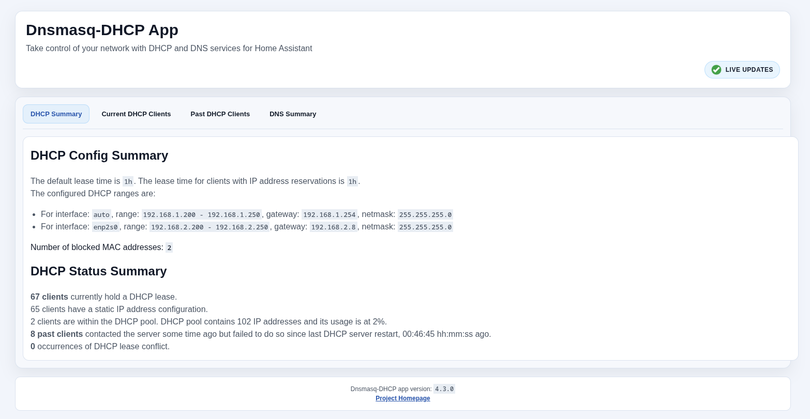
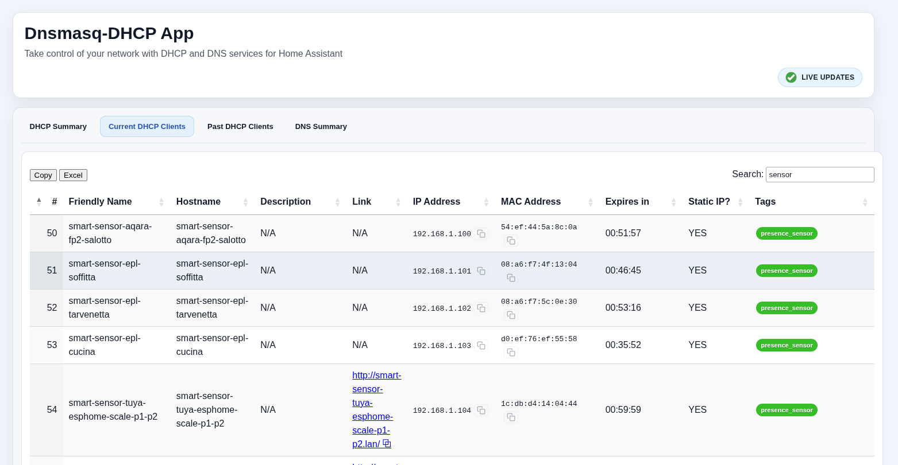
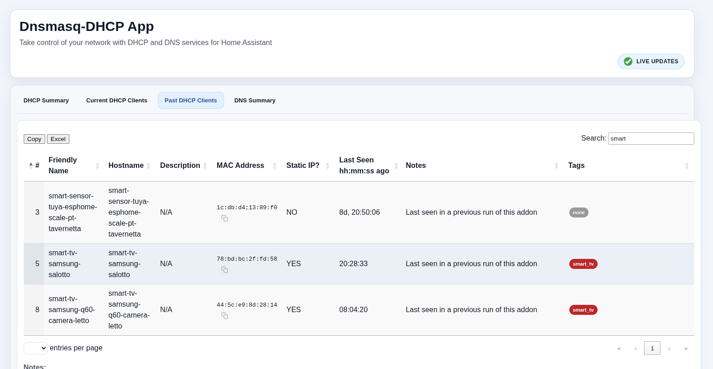
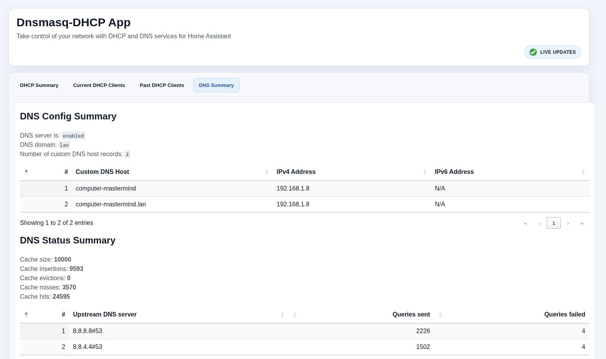

![Supports aarch64 Architecture][aarch64-shield]
![Supports amd64 Architecture][amd64-shield]

# Dnsmasq-DHCP: add flexible DNS and DHCP servers to your LAN

- [About](#about)
- [Why should I use a DHCP/DNS server](#why-should-i-use-a-dhcpdns-server)
- [Features](#features)
- [Web UI](#web-ui-screenshots)
- [Docs: How to Install and How to Configure](#how-to-install-and-how-to-configure)
- [Similar Apps](#similar-apps)
- [Other Noteworthy Projects](#other-noteworthy-projects)
- [Development](#development)

⭐ If you find this App useful, please star this repo - it helps others discover the project!

## 📋 About

*Take control of your network!*
If you want to

* **know** which devices are connected to your LAN/Wifi network?
* **label** each device in the way you like
* quickly access each device **control page** (if any)
* view **connectivity details** (IP, MAC addresses)

... then this app is what you're looking for. This app provides:

* a DHCP server
* a DNS server (optional)

that are meant to be used in your HomeAssistant Local Area Network (LAN), to make HomeAssistant the central point of 
your home network configuration: IP address allocations (via DHCP), hostname resolutions (via DNS), etc.

This app also implements an **handy UI to view the list of both current and past DHCP clients**, showing for each client all relevant information that can be obtained through DHCP.
Some basic DNS statistic is available from the UI as well.

Under the hood, the DNS/DHCP server is the well-known [dnsmasq](https://thekelleys.org.uk/dnsmasq/doc.html) server. 
Please note that despite the name '`dnsmasq`' also provides DHCP server functionalities, not only DNS.
Several similar solutions employ instead the [ISC dhcpd](https://www.isc.org/dhcp/) utility, however dnsmasq is on many aspects more feature-complete than the ISC DHCP server. Moreover ISC DHCP is discontinued since 2022.

## 💡 Why should I use a DHCP/DNS server

You will have many benefits like:
* remove static IP address configurations from end devices, to centralize IP address control;
* get fine-grained control over which devices connect to your network and when;
* establish a basic heartbeat (DHCP lease renewal) to check which devices are still up and running;
* use human-friendly DNS names to connect to your devices;

## ✨ Features

* 🌐 **Web-based UI** integrated in Home Assistant to view the list of all DHCP clients; the web UI is *responsive* and has nice rendering also from mobile phones (this is handy when you're e.g. installing a new Wifi or wired device in your network and you only have your mobile phone).
* ⚡ **UI Instant update**: no need to refresh the UI, whenever a new DHCP client connects to or leaves the network
  the UI gets instantly updated.
* 🔒 **IP address reservation** using the MAC address: you can associate a specific IP address (even outside
  the DHCP address pool) to particular hosts.
* 🏷️ **Friendly name configuration**: you can provide your own friendly-name to any host (using its MAC address
  as identifier); this is particularly useful to identify the DHCP clients that provide unhelpful hostnames
  in their DHCP requests.
* 🕐 **NTP and DNS server options**: you can advertise in DHCP OFFER packets whatever NTP and DNS server you want.
* 📊 **Past DHCP clients**: the app keeps track of _any_ DHCP client ever connected to your network, and allows you to check if some important device in your network was connected in the past but somehow has failed to renew its DHCP lease (e.g. it is shut down).
* 💾 **DNS local cache**: speed up DNS in your network by using this app as your home DNS server: `dnsmasq` will cache DNS resolutions from upstream servers to dramatically lower DNS resolution latency; in addition `dnsmasq` will be able to resolve any of your home device to your LAN IP address.
* 🏔️ **Rock-solid DHCP and DNS server**: this app is using the [dnsmasq](https://thekelleys.org.uk/dnsmasq/doc.html) utility which is deployed in millions of devices since roughly 2001.

For technical savvy users, note that this app _should_ support IPv6 but so far has been tested by
its author only on IPv4 networks.

## 🖼️ Web UI Screenshots

These are screenshots from the app UI v4.3.0. The UI supports both light and dark modes.

<table>
  <tr>
    <td align="center" width="50%">
      <strong>DHCP Summary</strong> 
      View all DHCP statistics and server status at a glance
        
      
    </td>
    <td align="center" width="50%">
      <strong>Current DHCP Clients</strong> 
      Real-time updates with lease expiration time, custom DNS links 
      Sortable columns, responsive design
        
      
    </td>
  </tr>
  <tr>
    <td align="center" width="50%">
      <strong>Past DHCP Clients</strong> 
      Historical view of all devices that ever connected to your network
        
      
    </td>
    <td align="center" width="50%">
      <strong>DNS Statistics</strong> 
      DNS query metrics and performance insights
        
      
    </td>
  </tr>
</table>

## 🚀 Documentation: How to Install and How to Configure

Check out the [app docs](DOCS.md). Open an [issue](https://github.com/f18m/ha-addon-dnsmasq-dhcp-server/issues) if you hit any problem.

## 🔄 Similar Apps

* [dnsmasq](https://github.com/home-assistant/addons/tree/master/dnsmasq): a simple DNS server app (no DHCP).
* [AdGuard Home](https://github.com/hassio-addons/addon-adguard-home): network-wide ads & trackers blocking DNS server. It also includes an embedded DHCP server.

Please note that you can use this app in tandem with similar apps and e.g. configure AdGuard Home to fallback to the DNS server provided by this app only for hosts having the `lan` top-level domain.

## ⭐ Other Noteworthy Projects

* [pihole](https://pi-hole.net/): pi-hole embeds a modified `dnsmasq` variant (they named it "FTL", Faster Than Light) which provides a bunch of DNS metrics that are missing from the regular `dnsmasq` binary.

## 🛠️ Development

See the [Home Assistant app guide](https://developers.home-assistant.io/docs/apps/). This app was originally inspired by other 2 apps maintained by Home Assistant team:
* https://github.com/home-assistant/addons/tree/master/dnsmasq
* https://github.com/home-assistant/addons/tree/master/dhcp_server

The UI nginx reverse-proxy configuration has been adapted from:
* https://github.com/alexbelgium/hassio-addons/tree/master/photoprism/

For the init system used by HA apps, see:
* https://github.com/just-containers/s6-overlay

For the templating language used in e.g. [dnsmasq config](./rootfs/usr/share/tempio/dnsmasq.config)
* https://github.com/home-assistant/tempio

[aarch64-shield]: https://img.shields.io/badge/aarch64-yes-green.svg
[amd64-shield]: https://img.shields.io/badge/amd64-yes-green.svg
