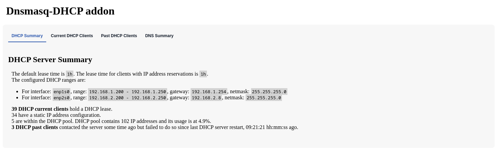
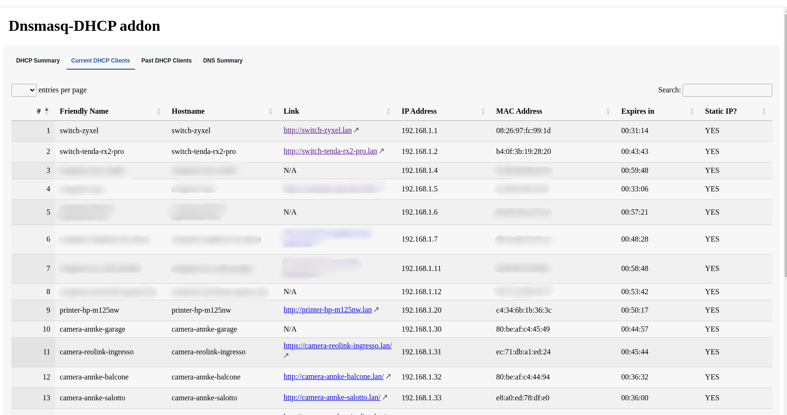
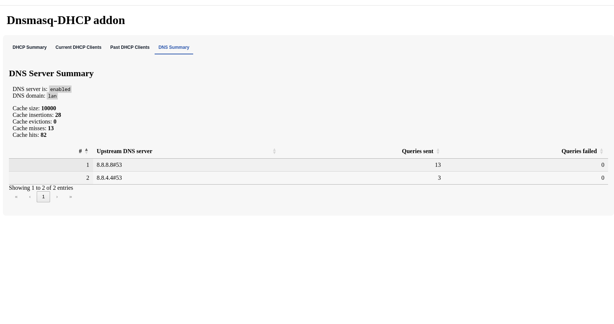

# Home Assistant Add-on: Dnsmasq as DNS and DHCP server

*Take control of your network!*

![Supports aarch64 Architecture][aarch64-shield] ![Supports amd64 Architecture][amd64-shield]

## Summary

- **Purpose**: Turn Home Assistant into the central DHCP (and optional DNS) server for your home network, using `dnsmasq`.
- **Key benefits**: Track current and past DHCP clients, assign friendly names and IP reservations, and quickly access device control pages.
- **Caution**: This addon will manage DHCP on your LAN. Misconfiguration (e.g. multiple DHCP servers) can disrupt network connectivity—follow the docs carefully.

Under the hood, the DNS/DHCP server is the well-known [`dnsmasq`](https://thekelleys.org.uk/dnsmasq/doc.html) utility.  
Unlike similar solutions that rely on the legacy [`ISC dhcpd`](https://www.isc.org/dhcp/) utility, this addon uses `dnsmasq`, which is more feature-complete and actively maintained. `ISC dhcpd` has been discontinued since 2022.

This addon also provides a handy **web UI to view the list of both current and past DHCP clients**, showing for each client all relevant information that can be obtained through DHCP. Some basic DNS statistics are available from the UI as well.

[aarch64-shield]: https://img.shields.io/badge/aarch64-yes-green.svg  
[amd64-shield]: https://img.shields.io/badge/amd64-yes-green.svg  

## About this addon

This addon sets up and manages a `dnsmasq` instance configured to run both as a DNS and DHCP server (despite the name, `dnsmasq` also provides DHCP functionalities, not only DNS).

It is meant to be used in your Home Assistant Local Area Network (LAN), making Home Assistant the central point of your home network configuration:

- IP address allocation via DHCP
- Hostname resolution via DNS
- IP reservations and device labeling

You can run it as:

- **DHCP + DNS** server for your LAN, or  
- **DHCP-only**, if you already have a DNS solution (e.g. AdGuard Home, Pi-hole) and just want better control and visibility over DHCP clients.

## Features

- **Web-based UI**: Integrated in Home Assistant to view the list of all DHCP clients. The web UI is responsive and renders nicely on mobile phones (handy when you are installing new Wi-Fi or wired devices and only have your phone).
- **Instant UI updates**: The UI updates in real time when a new DHCP client connects or leaves the network (no manual refresh needed).
- **IP address reservation**: Reserve specific IP addresses (even outside the DHCP pool) for particular hosts based on their MAC address.
- **Friendly name configuration**: Assign user-friendly names to any host, using its MAC address as the identifier. This is especially useful for DHCP clients that send unhelpful or generic hostnames in their DHCP requests.
- **Custom NTP and DNS options**: Advertise arbitrary NTP and DNS servers via DHCP options in the OFFER packets.
- **Past DHCP clients tracking**: Keep track of any DHCP client that has ever connected to your network and quickly spot devices that previously had a lease but have stopped renewing (e.g. shut down or disconnected devices).
- **DNS local cache** (optional but recommended): Speed up DNS in your network by using this addon as your home DNS server. `dnsmasq` caches DNS resolutions from upstream servers to dramatically reduce DNS latency and can resolve any of your home devices to their LAN IP addresses.
- **Rock‑solid DNS/DHCP**: Uses `dnsmasq`, which has been deployed in millions of devices since around 2001.

### IPv6 support

For technically savvy users: this addon *should* support IPv6, but so far it has been tested by its author only on IPv4 networks. IPv6 usage should therefore be considered experimental.

## Web UI

These are screenshots from the addon UI v3.0.0.

DHCP basic summary:

DHCP current clients, with DHCP lease expiration time indicator, custom link using the local DNS resolver (for the `lan` domain):

DNS basic stats:

The screenshots show the **Current** and **Past** DHCP clients tabs.  
The tables of DHCP clients are updated in real time (no manual refresh needed) and can be sorted on any column. They are also responsive and adapt nicely to small screens (cellphones).

The web UI supports both light and dark modes.

## Requirements & warnings

Before enabling this addon:

- **Home Assistant installation**: Ensure you are running a supported Home Assistant installation type (e.g. Home Assistant OS / Supervised).
- **Static IP**: Ensure your Home Assistant host has a static IP address in your LAN.
- **Single DHCP server**: Disable any existing DHCP server on your router or other devices to avoid running multiple DHCP servers on the same network.
- **Access path**: Verify that you will still be able to reach Home Assistant after switching DHCP servers (e.g. via IP, mDNS, or a hostname that resolves correctly).

If you lose connectivity after enabling the addon, double-check that:

- Only this addon is providing DHCP on your LAN.
- The DHCP range, gateway, and DNS information match your network configuration.

## Quick start

1. **Add the repository** that contains this addon to Home Assistant (if not already added).
2. **Install the addon** from the Home Assistant Add-on Store.
3. **Configure the addon**:
   - Set the DHCP range (start/end IP, netmask, gateway).
   - Set upstream DNS servers (or integrate with existing DNS solutions like AdGuard Home or Pi-hole).
   - Optionally configure IP reservations and friendly names.
4. **Disable your router’s DHCP server**, so this addon becomes the only DHCP server on your LAN.
5. **Start the addon**.
6. **Verify operation**:
   - Ensure devices obtain IP addresses from the configured range.
   - Open the addon’s web UI from Home Assistant and confirm that clients appear under “Current clients”.

For detailed configuration options, advanced scenarios, and troubleshooting, see the full docs.

## How to install and configure

Check out the full [addon docs](DOCS.md) for:

- Detailed configuration options
- Example network layouts (DHCP-only vs DHCP+DNS)
- Integration with AdGuard Home, Pi-hole, and similar tools
- Backup/restore tips and migration notes

If you hit any problem, please open an [issue](https://github.com/f18m/ha-addon-dnsmasq-dhcp-server/issues).

## Similar addons

- [Home Assistant dnsmasq addon](https://github.com/home-assistant/addons/tree/master/dnsmasq): a simple DNS server addon (no DHCP).
- [AdGuard Home](https://github.com/hassio-addons/addon-adguard-home): network-wide ads & trackers blocking DNS server, which also includes an embedded DHCP server.

You can use this addon **in tandem** with similar addons. For example, you can configure AdGuard Home or Pi-hole to **forward DNS queries for hosts in the `lan` domain** to this addon’s DNS server, while they handle general DNS filtering for the rest of the Internet.

## Other noteworthy projects

- [Pi-hole](https://pi-hole.net/): Pi-hole embeds a modified `dnsmasq` variant (called “FTL”, Faster Than Light) which provides a number of DNS metrics that are not available from the standard `dnsmasq` binary.

## Future developments

- Document all addon configuration settings in more detail.
- Expose DNS cache metrics similar to those described in the Pi-hole FTL DNS cache docs: <https://docs.pi-hole.net/ftldns/dns-cache/>
- Provide a Home Assistant sensor for DHCP clients transitioning from “current” to “past”.

## Development notes

See the [Home Assistant addon development guide](https://developers.home-assistant.io/docs/add-ons) for general addon development information.

This addon is based on two addons maintained by the Home Assistant team:

- <https://github.com/home-assistant/addons/tree/master/dnsmasq>
- <https://github.com/home-assistant/addons/tree/master/dhcp_server>

The UI nginx reverse proxy configuration has been adapted from:

- <https://github.com/alexbelgium/hassio-addons/tree/master/photoprism/>

For the init system used by HA addons, see:

- <https://github.com/just-containers/s6-overlay>

For the templating language used in e.g. [`dnsmasq` config](./rootfs/usr/share/tempio/dnsmasq.config), see:

- <https://github.com/home-assistant/tempio>

Contributions, bug reports, and feature requests are welcome via the GitHub issue tracker.
